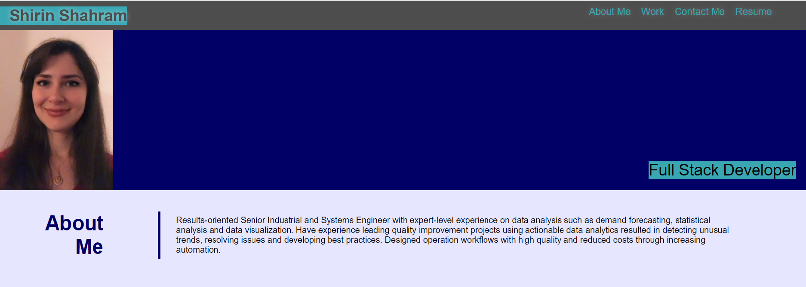
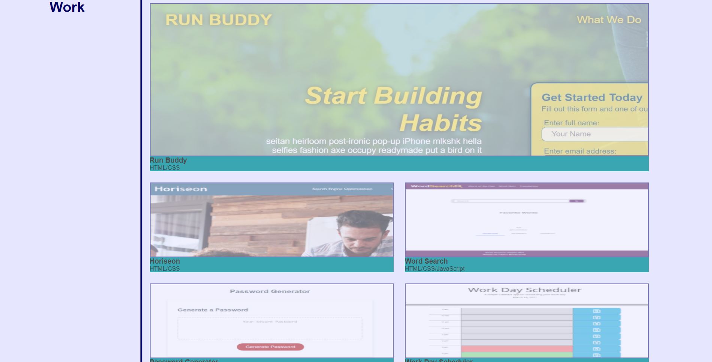
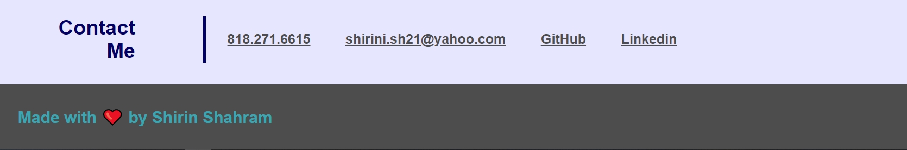

# Professional Portfolio

The main purpose of this project is to create a professional portfolio to show my background and my projects to potential employers.

## Task List

- [x] Add work samples
- [x] Add placeholders for future projects
- [x] Add my name, profile picture, about me, my work and contact me sections
- [x] Add proper links to different sections
- [x] Make first sample project larger than the rest
- [x] Make sure the website is mobile responsive

## Tech/framework used

* HTML
* CSS

## User Story

As an employer, I WANT to view a potential employee's deployed portfolio of work samples, So that I can review samples of their work and assess whether they're a good candidate for an open position.

## Acceptance Criteria

* When I load their portfolio, then I am presented with the developer's name, a recent photo, and links to sections about them, their work, and how to contact them
* When I click one of the links in the navigation, then the UI scrolls to the corresponding section
* WhenI click on the link to the section about their work, then the UI scrolls to a section with titled images of the developer's applications
* When I am presented with the developer's first application, then that application's image should be larger in size than the others
* WHEN I click on the images of the applications, then I am taken to that deployed application
* When I resize the page or view the site on various screens and devices, then I am presented with a responsive layout that adapts to my viewport

## Screenshot
Here is the snapshots of the website:

* Header, navigation bar, hero and "about me" sections:

* Work section:

* "Contact Me" and footer sections:
